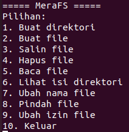

# Data Diri

|  |  |
|--|--|
| NIM | **2341720247** |
| Nama Lengkap | **Tiara Mera Sifa** |
| Kelas | TI-1B |
| Dosen Pengampu 1| Erfan Rohadi, S.T., M.Eng., Ph.D. |
| Dosen Pengampu 2| [Mohammad Faried Rahmat, S.ST., M.Tr.T](https://github.com/mrhmt80) |

# SISTEM OPERASI
### Fitur 
|  |  |  |
|--|--|--|
|**No**| **Fitur** | **Detail** |
| 1 | Buat Direktori | Membuat direktori baru dengan perintah ***mkdir*** |
| 2 | Buat File | Membuat file baru dengan perintah ***touch*** |
| 3 | Salin File | Menyalin file dengan perintah ***cp*** |
| 4 | Hapus File | Menghapus file dengan perintah ***rm*** |
| 5 | Baca File | Membaca isi file dengan perintah ***cat*** |
| 6 | Lihat Isi Direktori | Melihat isi sebuah direktori dengan perintah ***ls*** |
| 7 | Ubah Nama File | Mengubah nama file dengan perintah ***mv*** |
| 8 | Pindah File | Memindahkan file dengan perintah ***mv*** |
| 9 | Ubah Izin File | Mengubah izin file atau direktori dengan perintah ***chmod*** |

# SCREENSHOT PROGRAM

| MeraFS - Program Shell - UAS Praktikum Sistem Operasi |